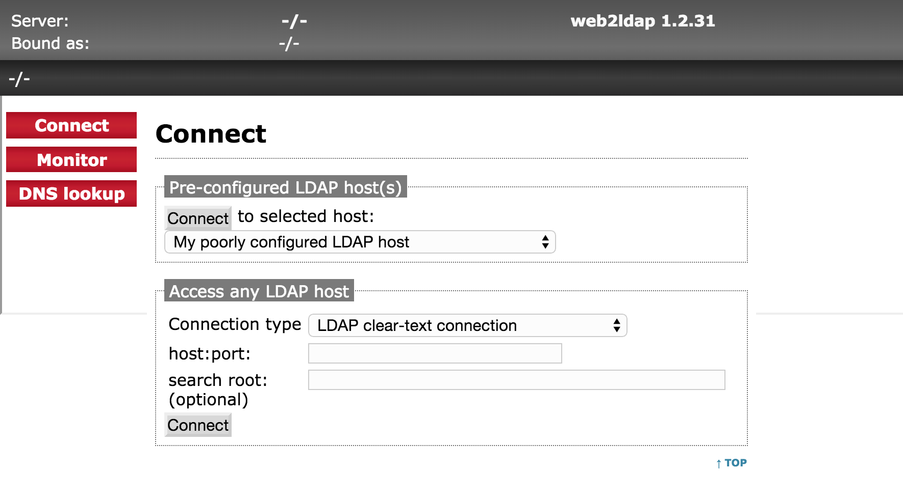

# web2ldap

A containerized LDAP client web application based on web2ldap (http://www.web2ldap.de/)

## Docker image

Docker image is available on the Docker Hub

* [jlrigau/web2ldap](https://registry.hub.docker.com/u/jlrigau/web2ldap/)

## Starting web2ldap

```console
$ docker run -d -p 1760:1760 jlrigau/web2ldap
```

Now you can access to web2ldap through the URL ```http://127.0.0.1:1760/web2ldap/```



## Building web2ldap

```console
$ docker build -t web2ldap .
```
